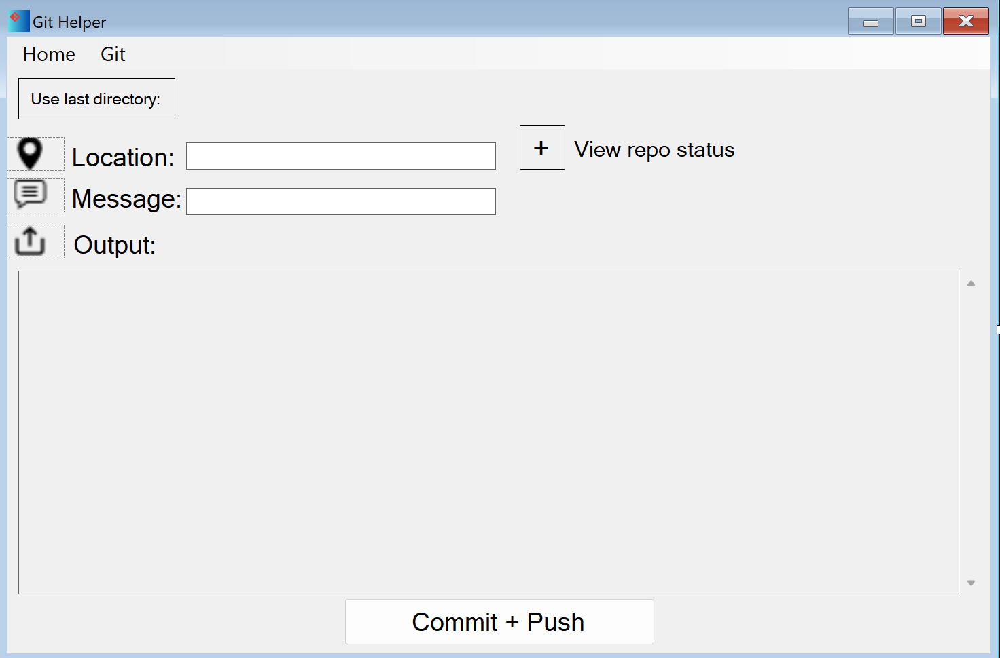

# Git-Helper

### Git Helper is a software that make work with [Git](https://git-scm.com/) easier.

# Functions

### Git Helper dispose of these functions:

- Status of a repo
- Commit + Push shortcut
- Output view
- Friendly GUI
- Repo log
- Git & Github opener
- Pull repo
- Create & clone repo

# GUI

## This GUI was created in Visual Stuido with .net framework (CLI/C++)

  

# Usage

### To use this repo you need to install Visual Studio editor and CLI (.net framework) in the insatller.
### Now clone the repo:
<pre>
  git clone https://github.com/HojdaAdelin/Git-Helper.git
</pre>
### After in the folder click on the .sln file
### Last step is to set:
<pre>
  Build Mode: Release & x64
</pre>

# Soon

- [x] Keep last repo directory
- [ ] Better main form
- [ ] New functions
- [ ] Dark GUI
